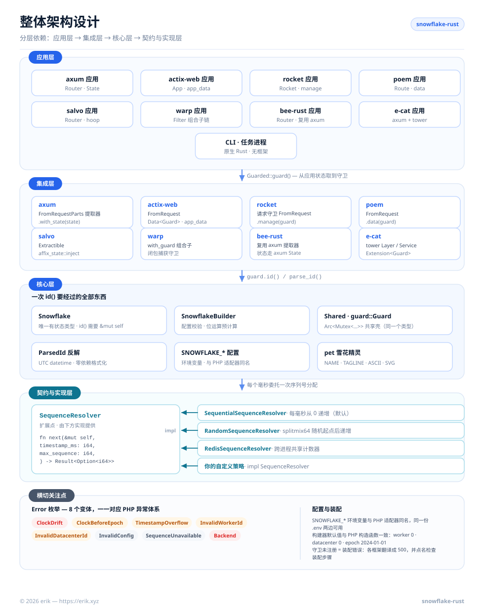
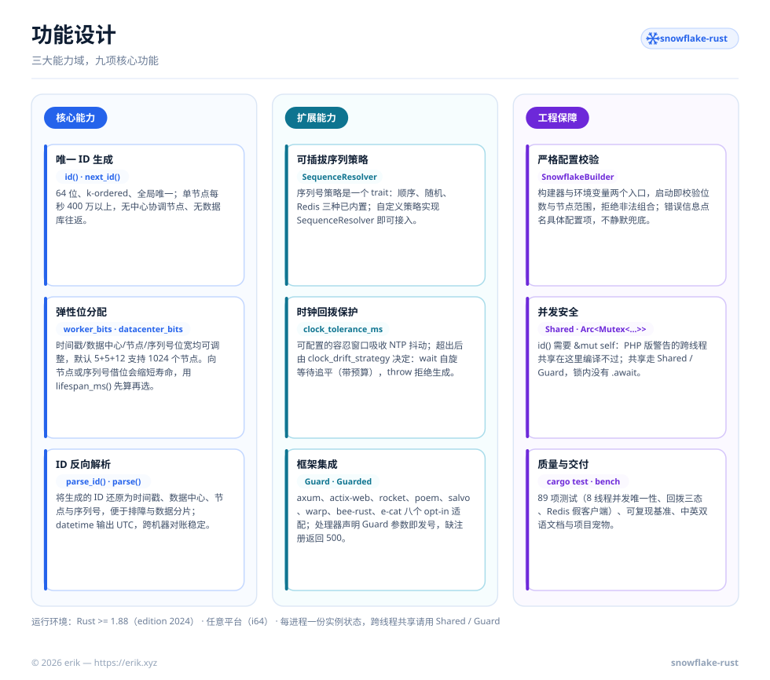
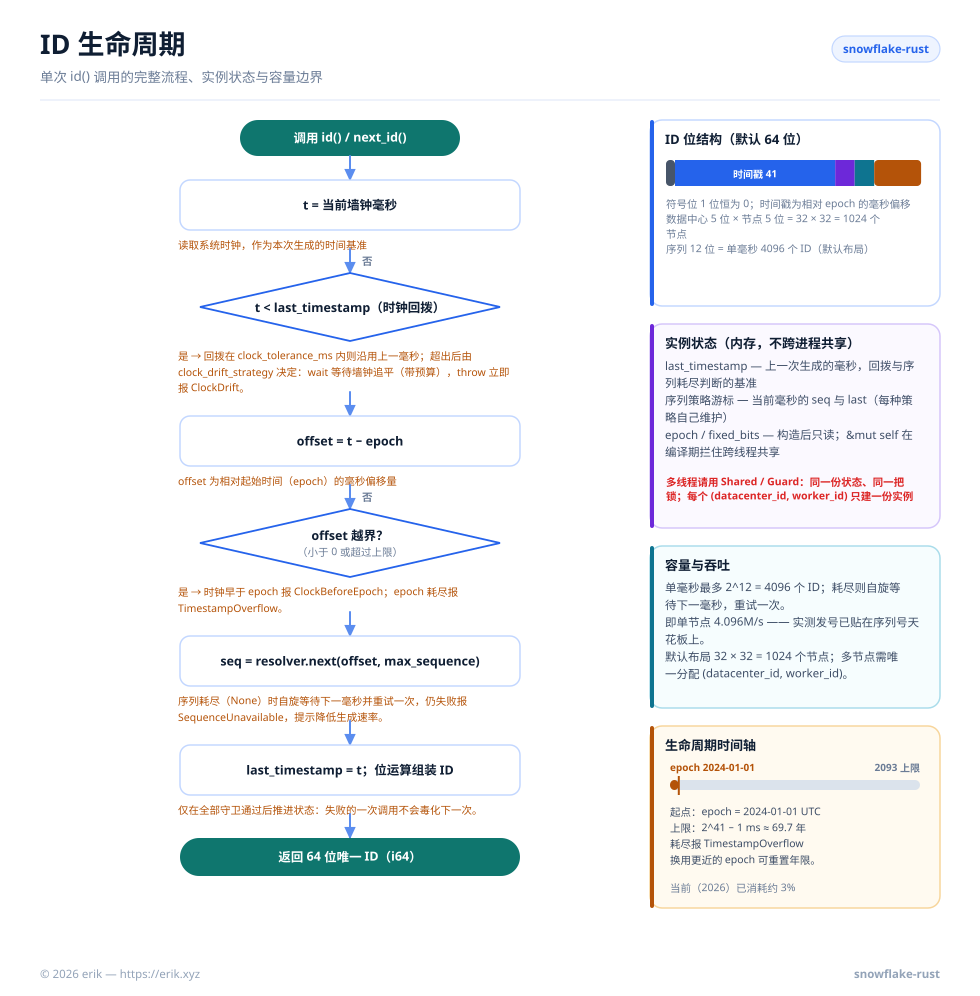
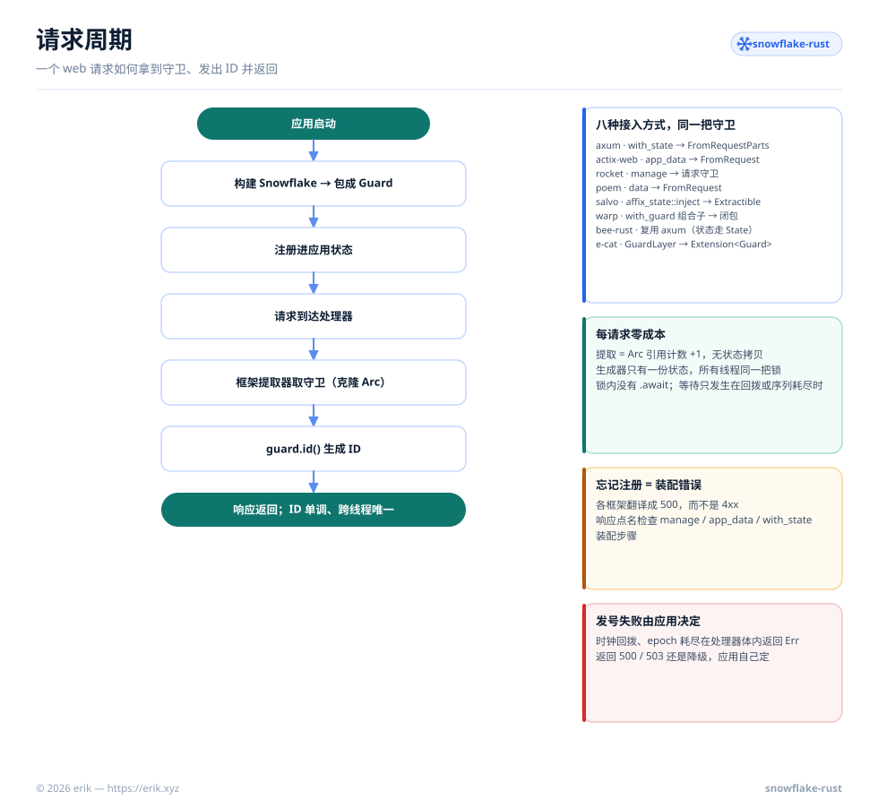

<!-- Copyright (c) 2026 erik <erik@erik.xyz> — https://erik.xyz -->

# Snowflake Rust

<p align="center">
  
  <br />
  <sub>宠物也已随代码发布——<code>println!("{}", snowflake::pet::ASCII);</code> 即可在终端打印它。</sub>
</p>

基于 Twitter Snowflake 算法的分布式唯一 ID 生成器：64 位、k-ordered、全局唯一，**纯 Rust std、真正零依赖**。Rust 移植自 PHP 包 [`erikwang2013/snowflake-php`](https://github.com/erikwang2013/snowflake-php) —— 宠物、简介、说明一并搬了过来。

[简体中文](./README.md) · [English](docs/i18n/README-en.md)

## 项目说明

Snowflake Rust 无需中心协调节点即可生成 64 位、k-ordered、全局唯一的 ID。每个 ID 由时间戳、数据中心 ID、工作节点 ID 和序列号组合而成——单节点每秒可生成上百万个 ID，无需数据库往返。

核心特性：

- **纯 Rust std，真正零依赖**——核心依赖表是空的：随机策略用内置 splitmix64，datetime 手写 UTC 格式化，错误手写 `Display`，Redis 客户端以 trait 注入；框架集成的依赖全部 opt-in，默认构建一个都不拉
- **可插拔序列号策略**——内置顺序递增、随机与 Redis 三种策略，实现 `SequenceResolver` trait 即可自定义
- **灵活的位分配**——可调整时间戳/节点/数据中心/序列号的位数以适应业务规模
- **时钟回拨容忍**——可配置的 NTP 校时容忍窗口，`throw` / `wait` 两种策略
- **并发安全由类型系统保证**——`id()` 需要 `&mut self`：PHP 版「不要跨协程/线程共享实例」的警告在这里**编译不过**；共享走 `Shared`
- **框架集成**——axum / actix-web / rocket / poem / salvo / warp / bee-rust / e-cat 的 opt-in 适配，处理器直接声明 `Guard` 参数即可发号
- **ID 解析**——可将生成的 ID 反向分解为时间戳、节点、序列号等成分

## 项目宠物：雪花精灵


一片微笑的雪花。人设取自本库的位布局——**六个分支就是 64 位里分出去的那几段，中心是时间戳**。形象自 PHP 版原样移植，只换了铭牌。

| 形象 | 对应设计 |
|------|---------|
| 中心的雪核 | 时间戳字段（默认 41 位，约 69.7 年） |
| 六个对称分支 | worker / datacenter / sequence 三段位宽的对称分配 |
| 铭牌 `snowflake-rust` | 宠物名（`pet::NAME`）与版本标识 |
| 微笑的表情 | 单节点每秒上百万个 ID，不需要数据库往返 |

座右铭：**每一位都是从寿命里借的，省着用。**

形象以 `include_str!` 打进库里（[`src/pet.rs`](./src/pet.rs)，零运行时开销，不用就不链接），`pet::ASCII` 直接在终端或日志里打：

```rust
use snowflake::pet;

println!("{}", pet::ASCII);

//                   \       /
//                    \     /
//            *        \   /        *
//               ------(^_^)------
//            *        /   \        *
//                    /     \
//                   /       \
//                 snowflake-rust
//    64-bit distributed unique ID generator
```

`pet::NAME` / `pet::TAGLINE` / `pet::ASCII` / `pet::SVG` 四个常量对外公开，README、CLI banner、下游管理界面共用同一份。

`docs/pet.svg` **不能**进 Cargo 的 `exclude` —— `include_str!` 在编译期读它，排掉就当场编译失败（`cargo package` 会直接报错，不会静默漏发）。

CLI 自带宠物：不带参数运行 `snowflake-rust` 会打印它并发一个 ID。

---

## 项目结构

```text
snowflake-rust/
├── src/
│   ├── lib.rs                 crate 文档、模块导出
│   ├── snowflake.rs           核心：Snowflake、SnowflakeBuilder、id()、生命周期守卫
│   ├── parse.rs               ParsedId 反解 + 零依赖 UTC 日期格式化
│   ├── config.rs              SNOWFLAKE_* 环境变量（对应 PHP 的 fromEnvironment()）
│   ├── error.rs               Error 枚举 + Display + std::error::Error
│   ├── resolver.rs            SequenceResolver trait（扩展点）
│   ├── resolvers/
│   │   ├── sequential.rs      默认：每毫秒从 0 顺序递增
│   │   ├── random.rs          每毫秒随机起点后递增（splitmix64）
│   │   └── redis.rs           RedisClient trait + RedisSequenceResolver
│   ├── shared.rs              Shared(Arc<Mutex<Snowflake>>) —— 7 个 PHP 适配器的共同本质
│   ├── guard.rs               Guard（= Shared 的框架语境名字）+ Guarded trait 宿主
│   ├── integrations/          axum / actix-web / rocket / poem / salvo / warp / bee-rust / e-cat
│   │                          （每框架一个 opt-in feature，默认一个都不拉）
│   ├── pet.rs                 项目宠物（NAME / TAGLINE / ASCII / SVG）
│   └── bin/snowflake.rs       CLI：宠物 banner、发号、反解
├── examples/
│   ├── quickstart.rs          对应 docs/examples/plain-php.php，可直接运行
│   └── bench.rs               对应 scripts/benchmark.php，可复现吞吐基准
├── tests/                     核心生成、位分配、时钟守卫、解析、策略、Redis、环境变量
├── scripts/
│   ├── generate-diagrams.py   生成 docs/i18n/img/<lang>/*.svg（本 README 的图）
│   └── i18n/labels.<lang>.json  各语言的图内文案
├── docs/
│   ├── pet.svg                项目宠物（include_str! 打进库）
│   ├── i18n/
│   │   ├── README-en.md       English README
│   │   └── img/<lang>/        架构 / 功能 / 生命周期 / 请求周期 图
│   └── *.png                  赞助码
├── Cargo.toml                 核心零依赖
└── LICENSE                    MIT
```

## 架构设计



四层结构，依赖方向单向向下：

- **应用层** —— 你的 axum / actix-web / tokio 服务、CLI、任务进程，或任何 Rust 程序；它只需要一个 `Snowflake` 实例（共享时用 `Shared`）。
- **共享层** —— `Shared` 是核心的共享壳（`Arc<Mutex<Snowflake>>`），`guard::Guard` 是它在框架集成语境下的**同一个类型**。PHP 版为 Laravel / Yii2 / Yii3 / Webman / ThinkPHP / Hyperf / PSR-11 各写了一个适配器，做的事情其实是两件：**注册共享单例**（Rust 侧就是 `Shared`，`&mut self` 在编译期拦住 PHP 警告的跨协程共享）与**按框架惯例注入请求上下文**（Rust 侧是 `integrations` 里 8 个 opt-in 薄适配，处理器直接声明 `Guard` 参数）。Rust 不需要为每个 DI 容器发明一套，状态就是普通类型加一个 `Guarded` trait。
- **核心层** —— `Snowflake` 是唯一的有状态类型：负责配置校验、位运算预计算、ID 生成与反解。
- **契约与实现层** —— `SequenceResolver` 是扩展点。核心把每个毫秒的序列号分配全部委托给它，因此更换策略（顺序 / 随机 / Redis / 自定义）无需改动生成器。
- **横切关注点** —— `Error` 一枚枚举对应 PHP 的语义化异常体系；`SNOWFLAKE_*` 环境变量与 PHP 各适配器同名，一套 .env 两边通用。

## 功能设计



九项功能分属三大能力域：

| 能力域 | 功能 |
|--------|------|
| **核心能力** | 唯一 ID 生成（`id()` / `next_id()`）· 弹性位分配（`lifespan_ms()` 先算寿命）· ID 反向解析（`parse_id()` / `parse()`） |
| **扩展能力** | 可插拔序列策略（`SequenceResolver` trait）· 时钟回拨保护（容忍窗口 + `wait` / `throw`）· 框架集成（8 个 opt-in feature，`Guard` 请求守卫） |
| **工程保障** | 严格配置校验（构建器 + 环境变量两个入口）· 并发安全（`&mut self` 编译期保证，`Shared` / `Guard` 共享）· 质量与交付（89 项测试、可复现基准、中英双语文档） |

## ID 生命周期



每次 `id()` 调用都遵循同一条路径：

1. 读取当前毫秒并检查时钟回拨——在 `clock_tolerance_ms` 内可容忍；超出后由 `clock_drift_strategy` 决定：`wait` 等待墙钟追平（以 `clock_drift_wait_ms` 为预算），`throw` 直接拒绝生成。
2. 换算为相对 epoch 的偏移量，并拒绝小于 0（`ClockBeforeEpoch`）或超出时间戳上限（`TimestampOverflow`）的偏移。
3. 向序列号策略申请当前毫秒的下一个序列号；4096 个序列全部用尽时（默认 12 位）自旋等待下一毫秒并重试一次。
4. 组装 `(offset << timestamp_shift) | fixed_bits | sequence`，推进 `last_timestamp` 后返回 ID。

实例状态（`last_timestamp` 与策略游标）保存在内存中；每一个守卫都通过之后才推进状态，失败的一次调用不会毒化下一次。

## 环境要求

- Rust ≥ 1.88（edition 2024；CI 建议 `cargo test` + `cargo clippy` 全绿）
- 任意平台——ID 是 `i64`，宽度与平台无关（PHP 版要求 64 位系统，Rust 没有这个问题）
- 每进程一份实例状态——`&mut self` 在编译期保证；跨线程共享请用 `Shared`

## 安装

```bash
cargo add snowflake-id-rust
```

> crates.io 上 `snowflake-rust` 这个包名已被 2020 年的其他项目占用，因此本包以
> **`snowflake-id-rust`** 发布。库名仍是 `snowflake`——代码里的
> `use snowflake::Snowflake;` 与项目名 snowflake-rust 都不受影响。

## 快速开始

```rust
use snowflake::Snowflake;

let mut snowflake = Snowflake::default();
let id = snowflake.id()?;          // 例如 365855445711060992
let id = snowflake.next_id()?;     // id() 的别名
```

指定 worker ID 和 datacenter ID：

```rust
use snowflake::Snowflake;

let mut snowflake = Snowflake::builder()
    .worker_id(5)
    .datacenter_id(3)
    .build()?;
let id = snowflake.id()?;
```

可运行的完整版本（含多线程共享与自检）见 [`examples/quickstart.rs`](./examples/quickstart.rs)：

```bash
cargo run --example quickstart
```

## 配置说明

| 配置项 | 构建器方法 | 环境变量 | 默认值 | 说明 |
|--------|-----------|---------|--------|------|
| `epoch` | `.epoch(i64)` | `SNOWFLAKE_EPOCH` | `1704067200000` | 自定义起始时间戳（毫秒），默认 2024-01-01 UTC |
| `worker_id` | `.worker_id(i64)` | `SNOWFLAKE_WORKER_ID` | `0` | 工作节点标识 |
| `datacenter_id` | `.datacenter_id(i64)` | `SNOWFLAKE_DATACENTER_ID` | `0` | 数据中心标识 |
| `worker_bits` | `.worker_bits(u32)` | `SNOWFLAKE_WORKER_BITS` | `5` | Worker ID 占用的位数（≥ 1） |
| `datacenter_bits` | `.datacenter_bits(u32)` | `SNOWFLAKE_DATACENTER_BITS` | `5` | Datacenter ID 占用的位数（≥ 1） |
| `sequence_bits` | `.sequence_bits(u32)` | `SNOWFLAKE_SEQUENCE_BITS` | `12` | 序列号占用的位数（≥ 1） |
| `sequence_resolver` | `.sequence_resolver(..)` | `SNOWFLAKE_SEQUENCE_RESOLVER` | `sequential` | 序列号策略：`sequential` 或 `random`；自定义策略在代码里注入 |
| `clock_tolerance_ms` | `.clock_tolerance_ms(i64)` | `SNOWFLAKE_CLOCK_TOLERANCE_MS` | `0` | 允许的时钟回拨最大值（毫秒），0 为严格模式 |
| `clock_drift_strategy` | `.clock_drift_strategy(..)` | `SNOWFLAKE_CLOCK_DRIFT_STRATEGY` | `throw` | 回拨超容忍时：`throw` 直接拒绝生成；`wait` 自旋等待墙钟追平 |
| `clock_drift_wait_ms` | `.clock_drift_wait_ms(i64)` | `SNOWFLAKE_CLOCK_DRIFT_WAIT_MS` | `1000` | `wait` 策略放弃前的最长等待（毫秒） |

环境变量名与 PHP 版各适配器**完全一致**；`SNOWFLAKE_SEQUENCE_RESOLVER` 是唯一例外：PHP 收类的完整限定名，Rust 不能按名字实例化类型，因此只认 `sequential` / `random` 两个内置名（自定义策略请用构建器注入）。

### 位分配

默认布局（63 数据位 + 1 符号位 = 64 位）：

```
| reserved(1) |  timestamp(41)   | datacenter(5) | worker(5) | sequence(12) |
```

默认起始时间下的最大可用年限：约 69 年（至 2093 年）。

工作节点位和序列号位都是从时间戳里借来的，序列号位开得越宽，生成器的寿命就越短：

| 工作节点 + 数据中心 + 序列号位数 | 时间戳位数 | 可用年限 |
|---|---|---|
| 5 + 5 + 12（默认） | 41 | 约 69.7 年 |
| 7 + 7 + 10 | 39 | 约 17.4 年 |
| 5 + 5 + 16 | 37 | 约 4.4 年 |
| 5 + 5 + 20 | 33 | 约 99 天 |

任意布局的上限都可以直接算出来：

```rust
use snowflake::Snowflake;

Snowflake::lifespan_ms(5, 5, 12)?;   // 默认布局，约 69.7 年（毫秒）
Snowflake::lifespan_ms(7, 7, 10)?;   // 约 17.4 年（毫秒）
```

偏移量一旦达到上限，epoch 即告耗尽——epoch 已经过期、窗口早已走完的话，第一次调用 `id()` 就会返回 `TimestampOverflow`。

### 通过环境变量创建

```rust
// SNOWFLAKE_WORKER_ID=1 SNOWFLAKE_DATACENTER_ID=2 ./your-service
let snowflake = snowflake::Snowflake::from_env()?;
```

变量未设置或去空白后为空时，落到默认值；非法整数会返回 `InvalidConfig` 并点名是哪个变量——不静默兜底。

## 并发与共享

PHP 版用七个框架适配器注册「容器里的共享单例」，并反复警告：不要在协程/线程之间共享实例。Rust 版把这两件事合并成一个类型：

```rust
use snowflake::{Shared, Snowflake};

let shared = Shared::new(
    Snowflake::builder().worker_id(1).datacenter_id(1).build()?,
);

// 每个线程拿到的只是壳（Arc），生成器状态只有一份
let handle = shared.clone();
std::thread::spawn(move || {
    let id = handle.id()?;
    // ...
});
```

`Shared` 实现 `Clone`，内部是 `Arc<Mutex<Snowflake>>`；`id()` / `next_id()` / `parse_id()` 直接可用，`lock()` 取到生成器本体做更细的操作。锁中毒会**恢复**而不是 panic——生成器没有跨字段不变量，持锁者 panic 最多让 `last_timestamp` 停在过去，「时钟不倒退」的守卫本来就在。

### 实例生命周期怎么选

| 运行环境 | 实例创建时机 |
|---------|-------------|
| CLI / 短命进程 | 内联创建，用完即弃——进程间不共享，无残留。 |
| tokio 服务 / 多线程服务 | 进程启动时创建一次，包进 `Shared`，分发给所有任务；分配唯一的 `(datacenter_id, worker_id)`。 |

`id()` 本身极快且不碰 `.await`：`std::sync::Mutex` 即可，锁的临界区里没有等待（等待只发生在时钟回拨或序列耗尽时）。**不要**给同一个 `(datacenter_id, worker_id)` 建两份实例——两份状态会在同一毫秒发出相同的序列号。

## 框架集成

处理器不该一路透传生成器：把 `Guard` 注册进应用状态，直接在参数里声明它。每个框架一个 opt-in feature，默认构建一个都不拉：

| feature | 注册方式 | 取用方式 |
|---------|---------|---------|
| `axum` | `.with_state(state)` | 处理器参数写 `Guard`（`FromRequestParts` 提取器） |
| `actix-web` | `.app_data(web::Data::new(guard))` | 处理器参数写 `Guard`（`FromRequest`） |
| `rocket` | `.manage(guard)` | 处理器参数写 `Guard`（请求守卫） |
| `poem` | `.data(guard)` | 处理器参数写 `Guard`（`FromRequest`） |
| `salvo` | `hoop(affix_state::inject(guard))` | 处理器参数写 `Guard`（`Extractible`） |
| `warp` | `with_guard(guard)` 组合子 | `.map(\|guard: Guard\| ...)` |
| `bee-rust` | 同 axum（bee_router 路由吃 axum handler，状态也走 axum 的 `State`） | 同 axum |
| `ecat` | `GuardLayer`（标准 tower `Layer`，与 e-cat 自己的中间件并排组装） | `Extension<Guard>` |

```toml
# Cargo.toml —— 只开你真正在用的那个
snowflake-id-rust = { version = "1.0", features = ["axum"] }
```

```rust,ignore
use axum::{routing::get, Router};
use snowflake::guard::Guard;
use snowflake::integrations::Guarded;
use snowflake::Snowflake;

#[derive(Clone)]
struct AppState {
    pool: Pool,           // 你的连接池、配置……
    snowflake: Guard,     // 发号守卫
}

impl Guarded for AppState {
    fn guard(&self) -> &Guard { &self.snowflake }
}

async fn create_order(guard: Guard) -> String {
    guard.id().map(|id| id.to_string()).unwrap_or_default()
}

let state = AppState { pool, snowflake: Guard::from_env()? };
let app = Router::new().route("/orders", get(create_order)).with_state(state);
```

真实应用的状态结构体不会只有一把发号器：实现 `Guarded` trait 指向守卫字段即可，旁边的连接池、配置不受影响；状态**就是**一把守卫时（`Guard` 或 `Arc<Guard>`）连这步都不用写。守卫与 `Shared` 是同一个类型——克隆只是一次 `Arc` 引用计数递增，每请求零成本，处理器拿到的与状态里的是**同一个发号器**。

忘了注册（`app_data` / `manage` / `with_state` 漏一步）不是 4xx，是**装配错误**：各适配层把它翻译成 500，并在响应里点名检查装配步骤。发号本身的失败（时钟回拨、epoch 耗尽、序列耗尽）发生在处理器体里，返回什么状态码由应用自己决定——本库不替你决定「时钟回拨该 500 还是 503」。

> 框架特性之间是 **Cargo feature 并集**：同一个二进制同时开两个框架特性时，两个都会进依赖图。生产构建只开你真正在用的那个。

## 请求周期



一个 web 请求拿号的全过程只有五步：

1. **应用启动**——构建 `Snowflake`，包成 `Guard`（`Guard::from_env()` 读 `SNOWFLAKE_*`）。
2. **注册**——把守卫放进应用状态（`with_state` / `app_data` / `manage` / `data` / `inject`），每个框架的惯例不同，放进去的是同一把守卫。
3. **请求到达**——框架的提取器按类型取到守卫，克隆一份交给处理器（`Arc` 引用计数 +1，无状态拷贝）。
4. **发号**——处理器调用 `guard.id()`；同一个进程里所有请求共用同一份生成器状态、同一把锁。
5. **返回**——ID 严格单调、跨线程唯一；发号失败（回拨超容忍、epoch 耗尽）在处理器体内返回 `Err`，转成什么状态码由应用决定。

忘了注册不是 4xx 而是**装配错误**：各适配层把它翻译成 500，并在响应里点名检查 `manage` / `app_data` / `with_state` 装配步骤。

## ID 解析

将 Snowflake ID 分解为各个组成部分：

```rust
use snowflake::Snowflake;

let mut snowflake = Snowflake::default();
let id = snowflake.id()?;

// 实例方法（使用当前实例的位分配）
let parsed = snowflake.parse_id(id);
// ParsedId {
//     timestamp_ms: 1791293813635,
//     datetime: "2026-10-06 13:36:53.635".to_string(),
//     worker_id: 0,
//     datacenter_id: 0,
//     sequence: 0,
// }

// 静态方法（使用默认位分配）
let parsed = Snowflake::parse(id, Snowflake::DEFAULT_EPOCH);
```

`datetime` 在 PHP 版里由 `date()` 按**服务器本地时区**格式化，Rust 版输出 **UTC**——两个时区的机器解析同一个 ID 得到同样的字符串，跨机器对账不再需要以 `timestamp_ms` 为准的提醒（当然它依然是与时区无关的绝对毫秒值）。

## 序列号策略

三种内置实现：

### SequentialSequenceResolver（默认）

经典的 Snowflake 行为。每个毫秒序列号从 0 开始顺序递增，保证单节点内 ID 严格单调递增。

```rust
use snowflake::Snowflake;
use snowflake::resolvers::SequentialSequenceResolver;

let mut snowflake = Snowflake::builder()
    .sequence_resolver(SequentialSequenceResolver::new())
    .build()?;
```

### RandomSequenceResolver

每个毫秒从随机位置开始，随后自增。比顺序策略更难预测，同时同一毫秒内的 ID 保持单调递增。随机源是内部 splitmix64（**不是密码学安全**，只为打乱起点）。

```rust
use snowflake::Snowflake;
use snowflake::resolvers::RandomSequenceResolver;

let mut snowflake = Snowflake::builder()
    .sequence_resolver(RandomSequenceResolver::new())
    .build()?;
```

### 自定义策略

实现 `SequenceResolver` trait：

```rust
use snowflake::{Result, SequenceResolver};

/// 示例：进程内共享计数器（真实场景里换成 Redis / 原子后端）
struct SharedCounterSequenceResolver {
    last_timestamp: i64,
    sequence: i64,
}

impl SequenceResolver for SharedCounterSequenceResolver {
    fn next(&mut self, timestamp_ms: i64, max_sequence: i64) -> Result<Option<i64>> {
        if timestamp_ms != self.last_timestamp {
            self.last_timestamp = timestamp_ms;
            self.sequence = 0;
        } else {
            self.sequence += 1;
        }

        // 本毫秒用尽返回 Ok(None)；后端故障返回 Err ——
        // 绝不把故障降级为 None，否则会静默发出重复 ID。
        Ok((self.sequence <= max_sequence).then_some(self.sequence))
    }
}
```

### RedisSequenceResolver

顺序与随机两种策略把序列号保存在进程内存里，多个进程共用同一个节点 ID 时可能发出相同的序列号。`RedisSequenceResolver` 把计数器放进 Redis——当多个进程共用同一组 `(datacenter_id, worker_id)` 时就用它。客户端以 trait 注入，本 crate 不依赖 `redis` crate：

```rust
use snowflake::Snowflake;
use snowflake::resolvers::{RedisClient, RedisSequenceResolver};

struct MyRedis(redis::Client); // 任何客户端，实现 RedisClient 两个方法即可

impl RedisClient for MyRedis {
    fn incr(&mut self, key: &str) -> snowflake::Result<i64> { /* ... */ }
    fn expire(&mut self, key: &str, seconds: u64) -> snowflake::Result<()> { /* ... */ }
}

let resolver = RedisSequenceResolver::new(MyRedis(client))
    .key_prefix("snowflake:seq:")   // 默认
    .ttl_seconds(1);                // 默认；低于 1 钳到 1

let mut snowflake = Snowflake::builder()
    .sequence_resolver(resolver)
    .build()?;
```

每个毫秒一个 key（`{key_prefix}{时间戳偏移}`），原子自增、各自过期；序号零基，越过 `max_sequence` 返回 `None`，核心等到下一毫秒——与顺序策略同一契约。key_prefix **不按节点隔离**：共用节点 ID 的进程必须共用前缀，否则等于没共享。

## 异常处理

| 错误变体 | 触发条件 | 对应的 PHP 异常 |
|----------|----------|----------------|
| `Error::ClockDrift` | 系统时钟回拨超过容忍值 | `ClockDriftException` |
| `Error::ClockBeforeEpoch` | 系统时钟早于配置的 epoch | `ClockDriftException`（自定义消息分支） |
| `Error::TimestampOverflow` | 时间戳偏移超过最大值（epoch 已耗尽） | `TimestampOverflowException` |
| `Error::InvalidWorkerId` | Worker ID 超出 `2^worker_bits - 1` | `InvalidWorkerIdException` |
| `Error::InvalidDatacenterId` | Datacenter ID 超出 `2^datacenter_bits - 1` | `InvalidDatacenterIdException` |
| `Error::InvalidConfig` | 位宽越界、策略取值错误、环境变量非法 | `\InvalidArgumentException` |
| `Error::SequenceUnavailable` | 序列号耗尽且等不到下一毫秒 | `\RuntimeException` |
| `Error::Backend` | 序列策略后端故障（如 Redis 连不上） | 客户端异常冒泡 |

## 分布式部署

在多服务器或进程部署时，确保每个实例使用唯一的 `(datacenter_id, worker_id)` 组合：

```rust
use snowflake::Snowflake;

// 从环境变量、主机名哈希或服务发现中获取
let snowflake = Snowflake::builder()
    .worker_id(std::env::var("WORKER_ID").unwrap().parse()?)
    .datacenter_id(std::env::var("DC_ID").unwrap().parse()?)
    .build()?;
```

默认 5+5 位分配可支持 32 个数据中心 × 32 个工作节点 = 1024 个独立节点。

如需更多节点，调整位分配：

```rust
// 10 worker 位 = 1024 个节点（datacenter 位保持 5，共 32 个数据中心）
let snowflake = Snowflake::builder()
    .worker_id(worker_id)
    .worker_bits(10)
    .build()?;
```

## 性能

ID 生成完全在进程内完成，没有一次系统调用之外的外部依赖。实测（rustc 1.99.0，`--release`，30 万次迭代，取 5 轮最优）：

| 操作 | 吞吐量 | 单次耗时 |
|------|-------:|---------:|
| 裸 `SystemTime::now()` —— 下限 | 4198 万/秒 | 23.8 ns |
| `SnowflakeBuilder::build()` | 1952 万/秒 | 51.2 ns |
| `id()` —— 默认 5+5+12 布局 | **411 万/秒** | 243.5 ns |
| `id()` + `parse_id()` | 258 万/秒 | 387.8 ns |

`id()` 的数字有个物理上限：每个毫秒最多 4096 个序列号（默认 12 位），即 **4.096M/s**——实测已经贴在它上面了。这与 PHP 版（算力先到顶，约 1.6M/s）不同：Rust 的整数运算快到序列槽位才是瓶颈，243ns 里绝大多数时间是在等下一个毫秒的槽位，发号侧已无优化空间。解析与构造才是可比较的计算量。

可在你自己的机器上复现：

```bash
cargo run --release --example bench
```

输出以裸时钟调用为基准的 ops/sec 与 ns/op，取 N 轮最优并给出波动。请对照基准列看比例，而不要把任何单次数字当作承诺——繁忙或虚拟化的宿主机上，时钟调用本身就会主导测量。

## 开源不易，欢迎支持

| 微信 | 支付宝 |
|:---:|:---:|
|  |  |

> 如果这个项目对你有帮助，欢迎扫码支持一下~

---

## License

MIT — Copyright (c) 2026 erik <erik@erik.xyz> — https://erik.xyz
