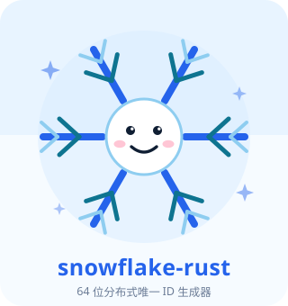
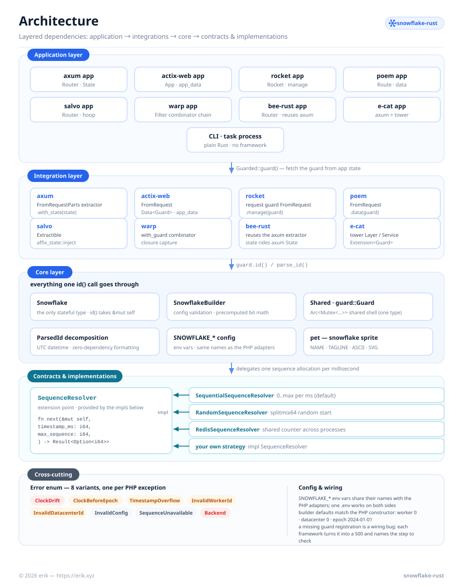
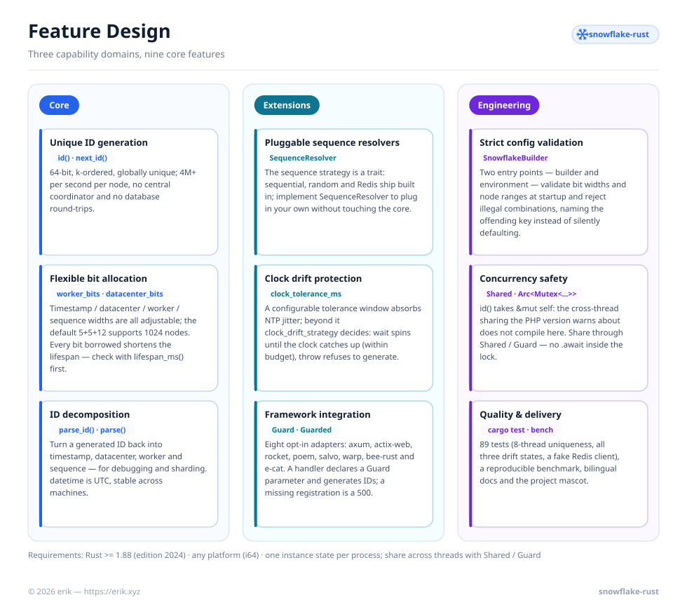
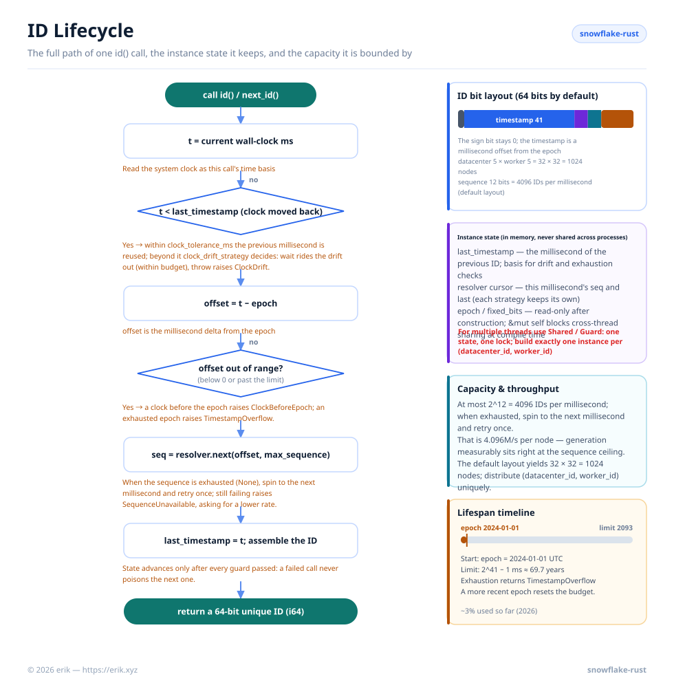
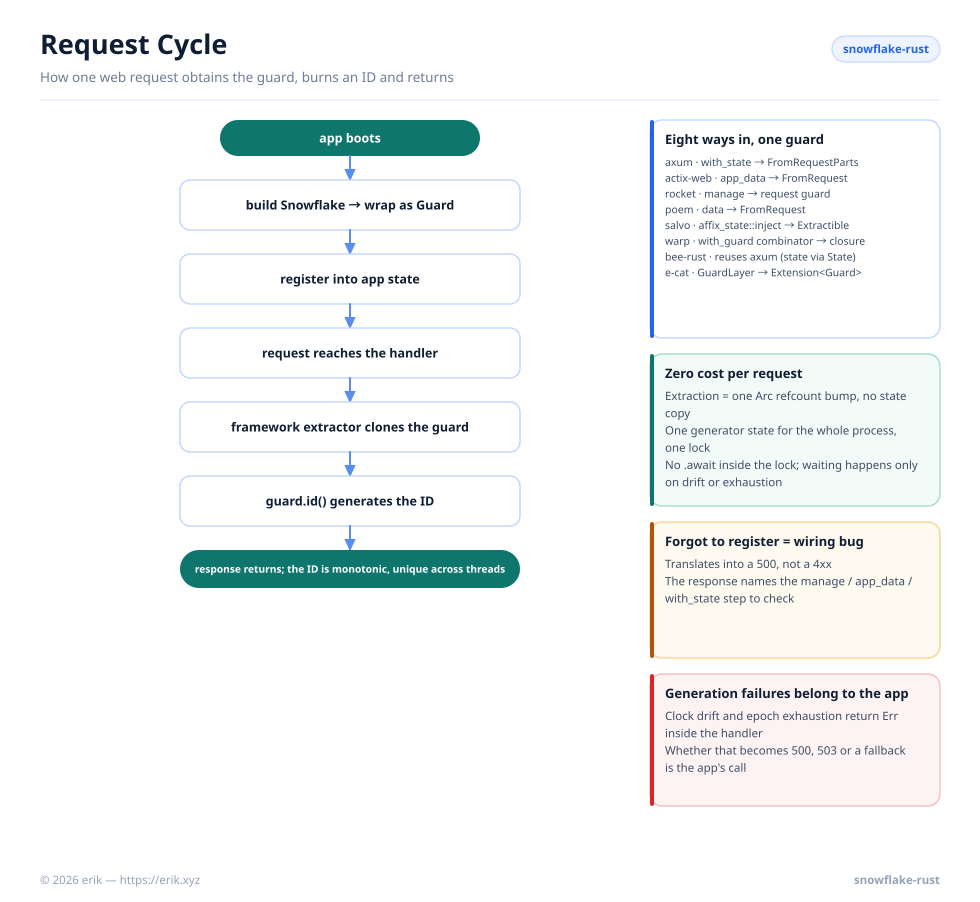

<!-- Copyright (c) 2026 erik <erik@erik.xyz> — https://erik.xyz -->

# Snowflake Rust

<p align="center">
  
  <br />
  <sub>The mascot ships with the code too — <code>println!("{}", snowflake::pet::ASCII);</code> prints it in any terminal.</sub>
</p>

A distributed unique ID generator based on Twitter's Snowflake algorithm: 64-bit, k-ordered, globally unique, **pure Rust std, truly zero dependencies**. Ported to Rust from the PHP package [`erikwang2013/snowflake-php`](https://github.com/erikwang2013/snowflake-php) — the mascot, the intro, and the docs came along with it.

[简体中文](../../README.md) · [English](./README-en.md)

## About

Snowflake Rust generates 64-bit, k-ordered, globally unique IDs without requiring a central coordinator. Each ID is composed of a timestamp, datacenter ID, worker ID, and sequence number — allowing millions of IDs per second per node with no database round-trips.

Key features:

- **Pure Rust std, truly zero dependencies** — the core dependency table is empty: the random resolver uses a built-in splitmix64, datetime is hand-written UTC formatting, errors have a hand-written `Display`, and Redis clients are injected through a trait; every framework-integration dependency is opt-in and nothing extra is pulled into a default build
- **Pluggable sequence resolvers** — sequential, random, and Redis-backed strategies ship built in; implement the `SequenceResolver` trait to bring your own
- **Flexible bit allocation** — adjust timestamp/node/datacenter/sequence bits to fit your scale
- **Clock drift tolerance** — a configurable tolerance window for NTP adjustments, with `throw` / `wait` strategies
- **Concurrency safety guaranteed by the type system** — `id()` takes `&mut self`: the PHP version's "don't share an instance across coroutines/threads" warning **does not compile** here; share through `Shared` instead
- **Framework integration** — opt-in adapters for axum / actix-web / rocket / poem / salvo / warp / bee-rust / e-cat, where a handler generates IDs simply by declaring a `Guard` parameter
- **ID parsing** — decompose generated IDs back into timestamp, node, and sequence components

## Project Mascot: the Snowflake Sprite


A smiling snowflake. The character design comes from this library's own bit layout — **the six arms are the segments carved out of the 64 bits, and the center is the timestamp**. The artwork was carried over from the PHP version as-is, with only the name plate changed.

| Design element | What it maps to |
|------|---------|
| The snow core at the center | The timestamp field (41 bits by default, ~69.7 years) |
| The six symmetric arms | The symmetric allocation of the worker / datacenter / sequence bit widths |
| The name plate `snowflake-rust` | The mascot's name (`pet::NAME`) and version tag |
| The smile | Millions of IDs per second per node, no database round-trips needed |

Motto: **every bit is borrowed from the lifespan — spend it wisely.**

The artwork is compiled into the library with `include_str!` ([`src/pet.rs`](../../src/pet.rs), zero runtime cost, never linked if unused); `pet::ASCII` prints it straight into a terminal or a log:

```rust
use snowflake::pet;

println!("{}", pet::ASCII);

//                   \       /
//                    \     /
//            *        \   /        *
//               ------(^_^)------
//            *        /   \        *
//                    /     \
//                   /       \
//                 snowflake-rust
//    64-bit distributed unique ID generator
```

Four constants are public — `pet::NAME` / `pet::TAGLINE` / `pet::ASCII` / `pet::SVG` — shared by the README, the CLI banner, and downstream admin panels.

The mascot also fills every **icon slot** in the code: rustdoc's crate logo and the browser-tab favicon both point at it (via `#![doc(html_logo_url / html_favicon_url)]` in `src/lib.rs`), so the snowflake is what you see on the docs.rs page and in the tab; the badge in the top-right corner of all four diagrams above is its miniature. Wherever there is an icon, it is the mascot.

`docs/pet.svg` must **not** go into Cargo's `exclude` — `include_str!` reads it at compile time, and excluding it fails the build outright (`cargo package` reports an error rather than silently shipping a broken crate).

The CLI ships with the mascot too: running `snowflake-rust` with no arguments prints it and generates an ID.

---

## Project Structure

```text
snowflake-rust/
├── src/
│   ├── lib.rs                 crate docs, module exports
│   ├── snowflake.rs           Core: Snowflake, SnowflakeBuilder, id(), lifecycle guards
│   ├── parse.rs               ParsedId decomposition + zero-dependency UTC date formatting
│   ├── config.rs              SNOWFLAKE_* environment variables (mirrors PHP's fromEnvironment())
│   ├── error.rs               Error enum + Display + std::error::Error
│   ├── resolver.rs            SequenceResolver trait (extension point)
│   ├── resolvers/
│   │   ├── sequential.rs      Default: 0..max per millisecond
│   │   ├── random.rs          Random start per millisecond, then increments (splitmix64)
│   │   └── redis.rs           RedisClient trait + RedisSequenceResolver
│   ├── shared.rs              Shared(Arc<Mutex<Snowflake>>) — the common essence of PHP's 7 adapters
│   ├── guard.rs               Guard (= the framework-context name for Shared) + host of the Guarded trait
│   ├── integrations/          axum / actix-web / rocket / poem / salvo / warp / bee-rust / e-cat
│   │                          (one opt-in feature per framework, none pulled in by default)
│   ├── pet.rs                 Project mascot (NAME / TAGLINE / ASCII / SVG)
│   └── bin/snowflake.rs       CLI: mascot banner, generate, parse
├── examples/
│   ├── quickstart.rs          Mirrors docs/examples/plain-php.php, runnable as-is
│   └── bench.rs               Mirrors scripts/benchmark.php, reproduces the throughput benchmark
├── tests/                     Core generation, bit allocation, clock guards, parsing, resolvers, Redis, env vars
├── scripts/
│   ├── generate-diagrams.py   Builds docs/i18n/img/<lang>/*.svg (the diagrams in this README)
│   └── i18n/labels.<lang>.json  Per-language diagram labels
├── docs/
│   ├── pet.svg                Project mascot (compiled in with include_str!)
│   ├── i18n/
│   │   ├── README-en.md       English README
│   │   └── img/<lang>/        architecture / features / lifecycle / request-cycle diagrams
│   └── *.png                  Sponsor QR codes
├── Cargo.toml                 zero-dependency core
└── LICENSE                    MIT
```

## Architecture



Four layers, with dependencies pointing in one direction only:

- **Application layer** — your axum / actix-web / tokio service, CLI, task process, or any Rust program; it only ever asks for a `Snowflake` instance (or `Shared` when sharing it).
- **Shared layer** — `Shared` is the core shared shell (`Arc<Mutex<Snowflake>>`), and `guard::Guard` is **the same type** under its framework-integration name. The PHP version wrote a separate adapter for Laravel / Yii2 / Yii3 / Webman / ThinkPHP / Hyperf / PSR-11, and what they actually did was two things: **register a shared singleton** (on the Rust side that is simply `Shared`; `&mut self` stops the cross-coroutine sharing the PHP version warns about at compile time) and **inject it into the request context per framework convention** (on the Rust side, the 8 thin opt-in adapters in `integrations`, where a handler declares a `Guard` parameter). Rust does not need to invent one per DI container: the state is an ordinary type plus a `Guarded` trait.
- **Core layer** — `Snowflake` is the only stateful type: it validates the configuration, precomputes the bit shifts, generates IDs, and parses them back.
- **Contracts & resolvers** — `SequenceResolver` is the extension point. The core delegates every sequence allocation to it, so swapping the strategy (sequential / random / Redis / custom) never touches the generator.
- **Cross-cutting** — a single `Error` enum mirrors PHP's semantic exception hierarchy; the `SNOWFLAKE_*` environment variables share their names with the PHP adapters, so one .env works on both sides.

## Feature Design



Nine features group into three capability domains:

| Domain | Features |
|--------|------|
| **Core** | Unique ID generation (`id()` / `next_id()`) · flexible bit allocation (`lifespan_ms()` computes the lifespan up front) · ID parsing (`parse_id()` / `parse()`) |
| **Extension** | Pluggable sequence resolvers (`SequenceResolver` trait) · clock-drift protection (tolerance window + `wait` / `throw`) · framework integration (8 opt-in features, the `Guard` request guard) |
| **Engineering** | Strict configuration validation (builder + environment variables, two entry points) · concurrency safety (`&mut self` enforced at compile time, sharing via `Shared` / `Guard`) · quality and delivery (89 tests, a reproducible benchmark, bilingual docs) |

## ID Lifecycle



Every `id()` call walks the same path:

1. Read the current millisecond and check for backward drift — tolerated up to `clock_tolerance_ms`; beyond that `clock_drift_strategy` decides: `wait` spins until the wall clock catches up (with `clock_drift_wait_ms` as the budget), `throw` refuses to generate.
2. Convert to an epoch offset and reject offsets that are negative (`ClockBeforeEpoch`) or past the timestamp limit (`TimestampOverflow`).
3. Ask the sequence resolver for the next slot in this millisecond; when all 4096 slots are used (12 bits by default), spin to the next millisecond and retry once.
4. Assemble `(offset << timestamp_shift) | fixed_bits | sequence`, advance `last_timestamp`, and return the ID.

Instance state (`last_timestamp` plus the resolver cursor) lives in memory; state advances only after every guard has passed, so a failed call never poisons the next one.

## Requirements

- Rust ≥ 1.88 (edition 2024; CI runs `cargo test` + `cargo clippy` clean)
- Any platform — IDs are `i64` and the width is platform-independent (the PHP version required a 64-bit system; Rust has no such problem)
- One instance of state per process — guaranteed at compile time by `&mut self`; use `Shared` to share across threads

## Installation

```bash
cargo add snowflake-id-rust
```

> The crate name `snowflake-rust` has been taken on crates.io by an unrelated
> 2020 project, so this package is published as **`snowflake-id-rust`**. The
> library name is still `snowflake` — `use snowflake::Snowflake;` and the
> snowflake-rust project name are unaffected.

## Quick Start

```rust
use snowflake::Snowflake;

let mut snowflake = Snowflake::default();
let id = snowflake.id()?;          // e.g. 365855445711060992
let id = snowflake.next_id()?;     // alias for id()
```

With custom worker and datacenter IDs:

```rust
use snowflake::Snowflake;

let mut snowflake = Snowflake::builder()
    .worker_id(5)
    .datacenter_id(3)
    .build()?;
let id = snowflake.id()?;
```

A runnable version of this — including multi-thread sharing and the invariants it checks — lives in [`examples/quickstart.rs`](../../examples/quickstart.rs):

```bash
cargo run --example quickstart
```

## Configuration Reference

| Key | Builder method | Env var | Default | Description |
|--------|-----------|---------|--------|------|
| `epoch` | `.epoch(i64)` | `SNOWFLAKE_EPOCH` | `1704067200000` | Custom epoch in ms (default: 2024-01-01 UTC) |
| `worker_id` | `.worker_id(i64)` | `SNOWFLAKE_WORKER_ID` | `0` | Worker/node identifier |
| `datacenter_id` | `.datacenter_id(i64)` | `SNOWFLAKE_DATACENTER_ID` | `0` | Datacenter identifier |
| `worker_bits` | `.worker_bits(u32)` | `SNOWFLAKE_WORKER_BITS` | `5` | Bits for worker ID (≥ 1) |
| `datacenter_bits` | `.datacenter_bits(u32)` | `SNOWFLAKE_DATACENTER_BITS` | `5` | Bits for datacenter ID (≥ 1) |
| `sequence_bits` | `.sequence_bits(u32)` | `SNOWFLAKE_SEQUENCE_BITS` | `12` | Bits for sequence number (≥ 1) |
| `sequence_resolver` | `.sequence_resolver(..)` | `SNOWFLAKE_SEQUENCE_RESOLVER` | `sequential` | Sequence strategy: `sequential` or `random`; inject custom resolvers in code |
| `clock_tolerance_ms` | `.clock_tolerance_ms(i64)` | `SNOWFLAKE_CLOCK_TOLERANCE_MS` | `0` | Max backward clock drift in ms (0 = strict) |
| `clock_drift_strategy` | `.clock_drift_strategy(..)` | `SNOWFLAKE_CLOCK_DRIFT_STRATEGY` | `throw` | When drift exceeds the tolerance: `throw` refuses to generate; `wait` spins until the wall clock catches up |
| `clock_drift_wait_ms` | `.clock_drift_wait_ms(i64)` | `SNOWFLAKE_CLOCK_DRIFT_WAIT_MS` | `1000` | How long the `wait` strategy waits before giving up |

Environment variable names are **identical** to the PHP adapters, with one exception: `SNOWFLAKE_SEQUENCE_RESOLVER`. PHP takes a fully-qualified class name, but Rust cannot instantiate a type by name, so only the two built-in names `sequential` / `random` are recognized (inject custom resolvers through the builder).

### Bit Layout

Default layout (63 data bits + 1 sign bit = 64 bits total):

```
| reserved(1) |  timestamp(41)   | datacenter(5) | worker(5) | sequence(12) |
```

Maximum lifespan with default epoch: ~69 years (until ~2093).

Every bit handed to the worker ID or the sequence is borrowed from the timestamp, so a wide sequence field silently shortens the generator's life:

| worker + datacenter + sequence bits | timestamp bits | usable lifespan |
|---|---|---|
| 5 + 5 + 12 (default) | 41 | ~69.7 years |
| 7 + 7 + 10 | 39 | ~17.4 years |
| 5 + 5 + 16 | 37 | ~4.4 years |
| 5 + 5 + 20 | 33 | ~99 days |

Ask for the limit of any layout:

```rust
use snowflake::Snowflake;

Snowflake::lifespan_ms(5, 5, 12)?;   // default layout, ~69.7 years (in ms)
Snowflake::lifespan_ms(7, 7, 10)?;   // ~17.4 years (in ms)
```

Once the offset reaches that limit the epoch is exhausted — a stale epoch whose window has already closed makes the very first `id()` call return `TimestampOverflow`.

### Creating from Environment Variables

```rust
// SNOWFLAKE_WORKER_ID=1 SNOWFLAKE_DATACENTER_ID=2 ./your-service
let snowflake = snowflake::Snowflake::from_env()?;
```

An unset variable — or one that is empty after trimming — falls back to its default; an invalid integer returns `InvalidConfig` naming the variable in question — no silent fallbacks.

## Concurrency & Sharing

The PHP version registers a "shared singleton in the container" through seven framework adapters, and warns again and again: never share an instance across coroutines or threads. The Rust version merges both jobs into a single type:

```rust
use snowflake::{Shared, Snowflake};

let shared = Shared::new(
    Snowflake::builder().worker_id(1).datacenter_id(1).build()?,
);

// each thread only gets the shell (Arc); there is exactly one copy of the generator state
let handle = shared.clone();
std::thread::spawn(move || {
    let id = handle.id()?;
    // ...
});
```

`Shared` implements `Clone` and wraps an `Arc<Mutex<Snowflake>>`; `id()` / `next_id()` / `parse_id()` are available directly, and `lock()` hands you the generator itself for finer-grained work. A poisoned lock is **recovered** rather than panicked on — the generator has no cross-field invariants, so at worst a panicking lock holder leaves `last_timestamp` in the past, and the "the clock never moves backwards" guard was already there.

### Choosing an Instance Lifetime

| Runtime | Build the instance |
|---------|-------------|
| CLI / short-lived processes | Inline, discard when done — nothing is shared between processes, nothing lingers. |
| tokio service / multi-threaded service | Once at process startup, wrap in `Shared`, hand it to every task; allocate a unique `(datacenter_id, worker_id)`. |

`id()` itself is very fast and never touches `.await`, so `std::sync::Mutex` is enough — nothing waits inside the critical section (waiting only happens on clock drift or sequence exhaustion). Do **not** build two instances for the same `(datacenter_id, worker_id)` — two copies of the state hand out the same sequence number in the same millisecond.

## Framework Integration

Handlers should not have to pass the generator down the call chain: register a `Guard` in application state and declare it directly in the parameter list. One opt-in feature per framework, none pulled in by a default build:

| feature | Registration | Extraction |
|---------|---------|---------|
| `axum` | `.with_state(state)` | handler parameter `Guard` (a `FromRequestParts` extractor) |
| `actix-web` | `.app_data(web::Data::new(guard))` | handler parameter `Guard` (`FromRequest`) |
| `rocket` | `.manage(guard)` | handler parameter `Guard` (request guard) |
| `poem` | `.data(guard)` | handler parameter `Guard` (`FromRequest`) |
| `salvo` | `hoop(affix_state::inject(guard))` | handler parameter `Guard` (`Extractible`) |
| `warp` | `with_guard(guard)` combinator | `.map(\|guard: Guard\| ...)` |
| `bee-rust` | Same as axum (bee_router routes take axum handlers, and state goes through axum's `State` too) | Same as axum |
| `ecat` | `GuardLayer` (a standard tower `Layer`, assembled alongside e-cat's own middleware) | `Extension<Guard>` |

```toml
# Cargo.toml — enable only the one you actually use
snowflake-id-rust = { version = "1.1", features = ["axum"] }
```

```rust,ignore
use axum::{routing::get, Router};
use snowflake::guard::Guard;
use snowflake::integrations::Guarded;
use snowflake::Snowflake;

#[derive(Clone)]
struct AppState {
    pool: Pool,           // your connection pool, config, ...
    snowflake: Guard,     // the ID guard
}

impl Guarded for AppState {
    fn guard(&self) -> &Guard { &self.snowflake }
}

async fn create_order(guard: Guard) -> String {
    guard.id().map(|id| id.to_string()).unwrap_or_default()
}

let state = AppState { pool, snowflake: Guard::from_env()? };
let app = Router::new().route("/orders", get(create_order)).with_state(state);
```

A real application's state struct holds more than a single ID generator: implement the `Guarded` trait to point at the guard field and the connection pool and configuration beside it are untouched; when the state **is** a guard (`Guard` or `Arc<Guard>`), even that step is unnecessary. The guard and `Shared` are one and the same type — cloning is a single `Arc` reference-count bump, zero cost per request, and what a handler receives is **the same generator** that lives in state.

Forgetting to register it (a missing `app_data` / `manage` / `with_state` step) is not a 4xx, it is a **wiring error**: each adapter layer translates it into a 500 and names the assembly step to check in the response. Failures in generation itself (clock drift, exhausted epoch, exhausted sequence) happen inside the handler body, and the status code to return is the application's call — this library does not decide for you whether "clock drift should be a 500 or a 503".

> Framework features are a **Cargo feature union**: when a single binary enables two framework features at once, both enter the dependency graph. A production build should enable only the one you actually use.

## Request Cycle



Handing out an ID for one web request takes just five steps:

1. **Boot** — build a `Snowflake` and wrap it in a `Guard` (`Guard::from_env()` reads the `SNOWFLAKE_*` variables).
2. **Register** — put the guard into application state (`with_state` / `app_data` / `manage` / `data` / `inject`); every framework has its own convention, but the guard that goes in is the same one.
3. **Request arrives** — the framework's extractor picks the guard up by type and clones it into the handler (one `Arc` reference-count bump, no state copy).
4. **Generate** — the handler calls `guard.id()`; every request in the process shares the same generator state and the same lock.
5. **Return** — IDs are strictly monotonic and unique across threads; a generation failure (drift beyond tolerance, exhausted epoch) comes back as `Err` inside the handler body, and the status code it turns into is the application's call.

Missing registration is not a 4xx but a **wiring error**: each adapter layer translates it into a 500 and names the `manage` / `app_data` / `with_state` assembly step to check in the response.

## ID Parsing

Decompose a Snowflake ID into its components:

```rust
use snowflake::Snowflake;

let mut snowflake = Snowflake::default();
let id = snowflake.id()?;

// Instance method (uses the current instance's bit layout)
let parsed = snowflake.parse_id(id);
// ParsedId {
//     timestamp_ms: 1791293813635,
//     datetime: "2026-10-06 13:36:53.635".to_string(),
//     worker_id: 0,
//     datacenter_id: 0,
//     sequence: 0,
// }

// Static method (uses the default bit layout)
let parsed = Snowflake::parse(id, Snowflake::DEFAULT_EPOCH);
```

In the PHP version `datetime` is formatted by `date()` in the **server's default timezone**; the Rust version emits **UTC** — two hosts in different timezones render the same ID identically, so reconciling IDs across machines no longer needs the "compare `timestamp_ms` instead" caveat (which, of course, remains the timezone-independent absolute value).

## Sequence Resolvers

Three built-in implementations:

### SequentialSequenceResolver (default)

Classic Snowflake behavior. Sequence starts at 0 each millisecond and increments sequentially, guaranteeing strictly monotonically increasing IDs within a single node.

```rust
use snowflake::Snowflake;
use snowflake::resolvers::SequentialSequenceResolver;

let mut snowflake = Snowflake::builder()
    .sequence_resolver(SequentialSequenceResolver::new())
    .build()?;
```

### RandomSequenceResolver

Starts each millisecond at a random position, then increments. Less predictable than sequential IDs while keeping IDs within a millisecond monotonic. The randomness comes from an internal splitmix64 (**not cryptographically secure** — it only shuffles the starting point).

```rust
use snowflake::Snowflake;
use snowflake::resolvers::RandomSequenceResolver;

let mut snowflake = Snowflake::builder()
    .sequence_resolver(RandomSequenceResolver::new())
    .build()?;
```

### Custom Resolver

Implement the `SequenceResolver` trait:

```rust
use snowflake::{Result, SequenceResolver};

/// Example: an in-process shared counter (swap in Redis / an atomic backend in real use)
struct SharedCounterSequenceResolver {
    last_timestamp: i64,
    sequence: i64,
}

impl SequenceResolver for SharedCounterSequenceResolver {
    fn next(&mut self, timestamp_ms: i64, max_sequence: i64) -> Result<Option<i64>> {
        if timestamp_ms != self.last_timestamp {
            self.last_timestamp = timestamp_ms;
            self.sequence = 0;
        } else {
            self.sequence += 1;
        }

        // Return Ok(None) when this millisecond is exhausted; return Err on a backend
        // failure — never downgrade a failure to None, or duplicate IDs go out silently.
        Ok((self.sequence <= max_sequence).then_some(self.sequence))
    }
}
```

### RedisSequenceResolver

The sequential and random resolvers keep the sequence in process memory, so processes sharing the same node ID can hand out the same sequence number. `RedisSequenceResolver` keeps the counter in Redis instead — the one to use when several processes share a `(datacenter_id, worker_id)` pair. The client is injected through a trait; this crate does not depend on the `redis` crate:

```rust
use snowflake::Snowflake;
use snowflake::resolvers::{RedisClient, RedisSequenceResolver};

struct MyRedis(redis::Client); // any client — implement the two RedisClient methods

impl RedisClient for MyRedis {
    fn incr(&mut self, key: &str) -> snowflake::Result<i64> { /* ... */ }
    fn expire(&mut self, key: &str, seconds: u64) -> snowflake::Result<()> { /* ... */ }
}

let resolver = RedisSequenceResolver::new(MyRedis(client))
    .key_prefix("snowflake:seq:")   // default
    .ttl_seconds(1);                // default; values below 1 clamp to 1

let mut snowflake = Snowflake::builder()
    .sequence_resolver(resolver)
    .build()?;
```

One key per millisecond (`{key_prefix}{timestamp offset}`), atomically incremented and expiring on its own; sequence numbers are zero-based, and passing `max_sequence` returns `None` so the core waits for the next millisecond — the same contract as the sequential resolver. `key_prefix` is **not partitioned per node**: processes sharing a node ID must share the prefix, or nothing is actually shared.

## Exception Handling

| Error variant | When | Equivalent PHP exception |
|----------|----------|----------------|
| `Error::ClockDrift` | System clock moved backwards beyond tolerance | `ClockDriftException` |
| `Error::ClockBeforeEpoch` | System clock is earlier than the configured epoch | `ClockDriftException` (custom-message branch) |
| `Error::TimestampOverflow` | Timestamp offset exceeds the maximum (epoch exhausted) | `TimestampOverflowException` |
| `Error::InvalidWorkerId` | Worker ID exceeds `2^worker_bits - 1` | `InvalidWorkerIdException` |
| `Error::InvalidDatacenterId` | Datacenter ID exceeds `2^datacenter_bits - 1` | `InvalidDatacenterIdException` |
| `Error::InvalidConfig` | Out-of-range bit width, bad resolver value, invalid environment variable | `\InvalidArgumentException` |
| `Error::SequenceUnavailable` | Sequence exhausted and the next millisecond never arrived | `\RuntimeException` |
| `Error::Backend` | Sequence backend failure (e.g. Redis unreachable) | client exception bubbles up |

## Distributed Deployment

When running across multiple servers or processes, ensure each instance uses a unique `(datacenter_id, worker_id)` pair:

```rust
use snowflake::Snowflake;

// Read from environment variables, a hostname hash, or service discovery
let snowflake = Snowflake::builder()
    .worker_id(std::env::var("WORKER_ID").unwrap().parse()?)
    .datacenter_id(std::env::var("DC_ID").unwrap().parse()?)
    .build()?;
```

With the default 5+5 bit layout, you can support up to 32 datacenters × 32 workers = 1024 unique nodes.

To support more nodes, adjust bit allocation:

```rust
// 10 worker bits = 1024 nodes (datacenter bits stay at 5, so 32 datacenters in total)
let snowflake = Snowflake::builder()
    .worker_id(worker_id)
    .worker_bits(10)
    .build()?;
```

## Performance

IDs are generated entirely in-process, with no external dependency beyond a single system call. Measured (rustc 1.99.0, `--release`, 300k iterations, best of 5):

| Operation | Throughput | Per call |
|------|-------:|---------:|
| Bare `SystemTime::now()` — the floor | 41.98M/s | 23.8 ns |
| `SnowflakeBuilder::build()` | 19.52M/s | 51.2 ns |
| `id()` — default 5+5+12 layout | **4.11M/s** | 243.5 ns |
| `id()` + `parse_id()` | 2.58M/s | 387.8 ns |

The `id()` number has a physical ceiling: at most 4096 sequence slots per millisecond (12 bits by default), i.e. **4.096M/s** — and the measurement is already sitting right against it. This is unlike the PHP version, which hit its compute ceiling first (around 1.6M/s): Rust's integer arithmetic is fast enough that the sequence slots are the bottleneck — the bulk of those 243 ns is spent waiting for the next millisecond's slot, and the issuing side has no room left to optimize. Parsing and construction are the comparable compute units.

Reproduce it on your own machine:

```bash
cargo run --release --example bench
```

It prints ops/sec and ns/op against a bare clock call as the baseline, best-of-N with the spread. Compare against the baseline rather than reading any single number as a promise — on a busy or virtualised host, the clock call itself dominates the measurement.

## Support Welcome

| WeChat Pay | Alipay |
|:---:|:---:|
|  |  |

> If this project helps you, feel free to show your support~

---

## License

MIT — Copyright (c) 2026 erik <erik@erik.xyz> — https://erik.xyz
